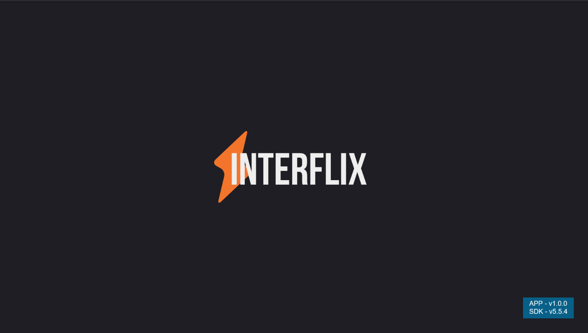
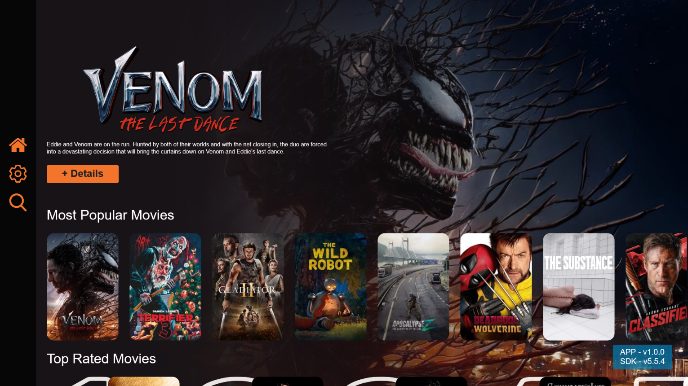
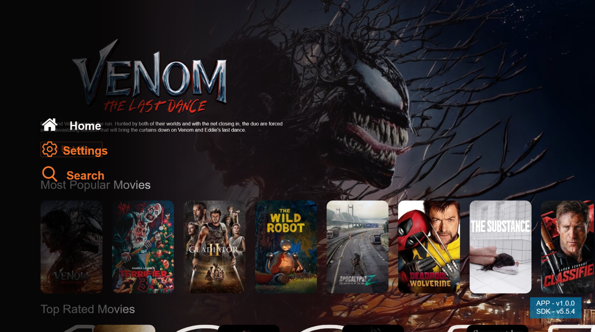
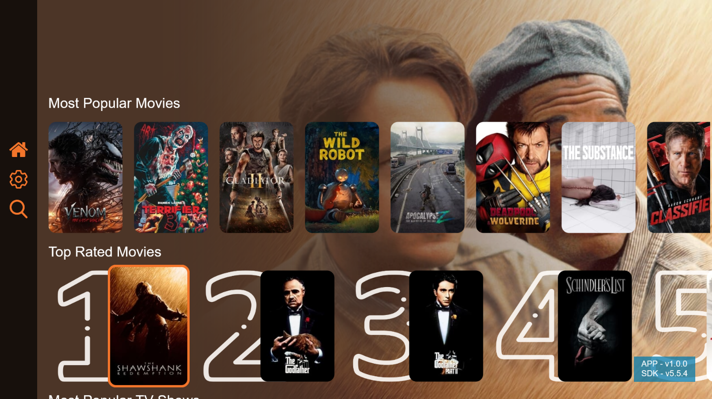
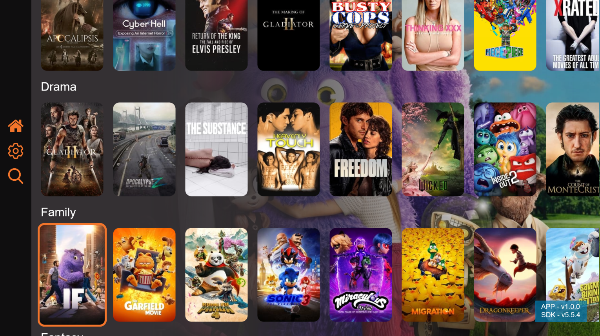
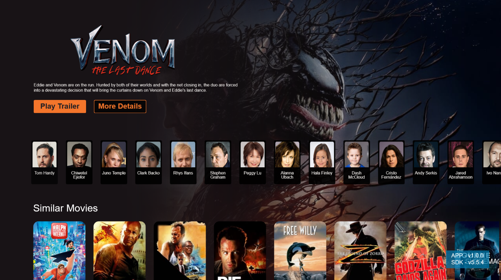
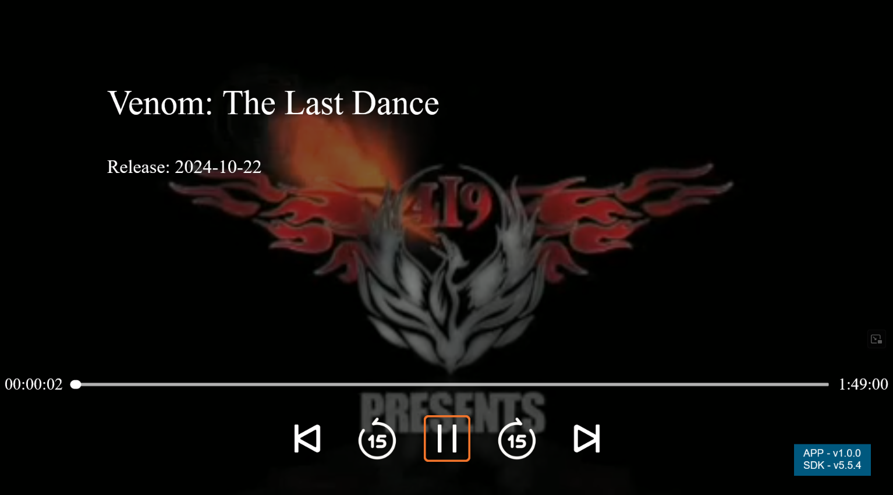
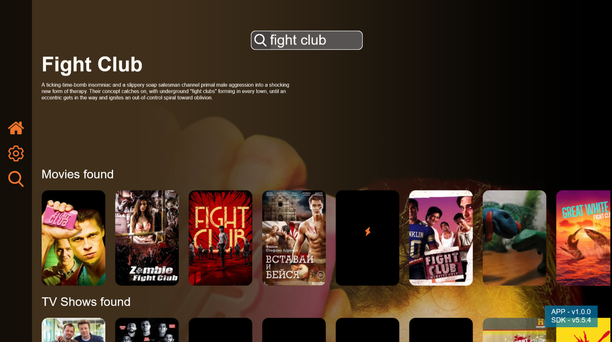
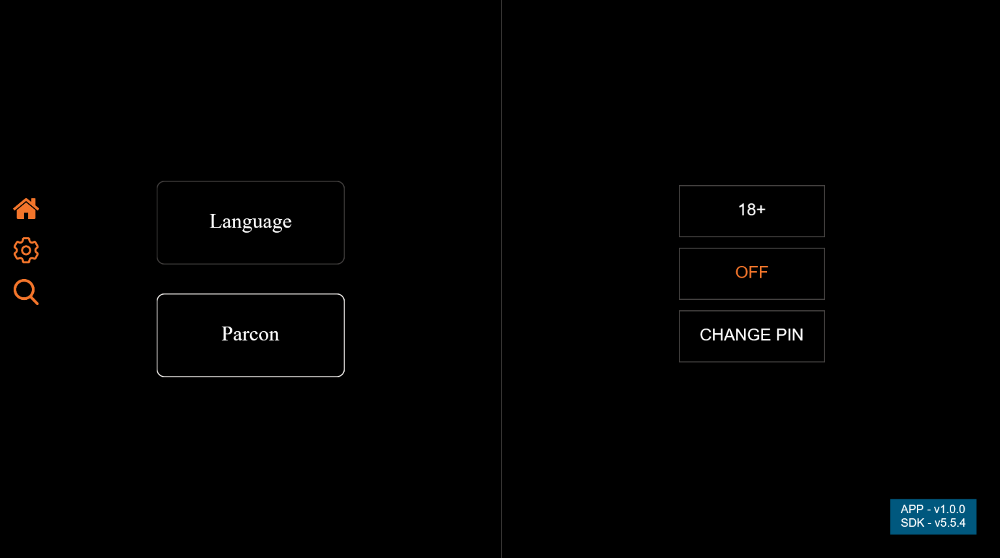
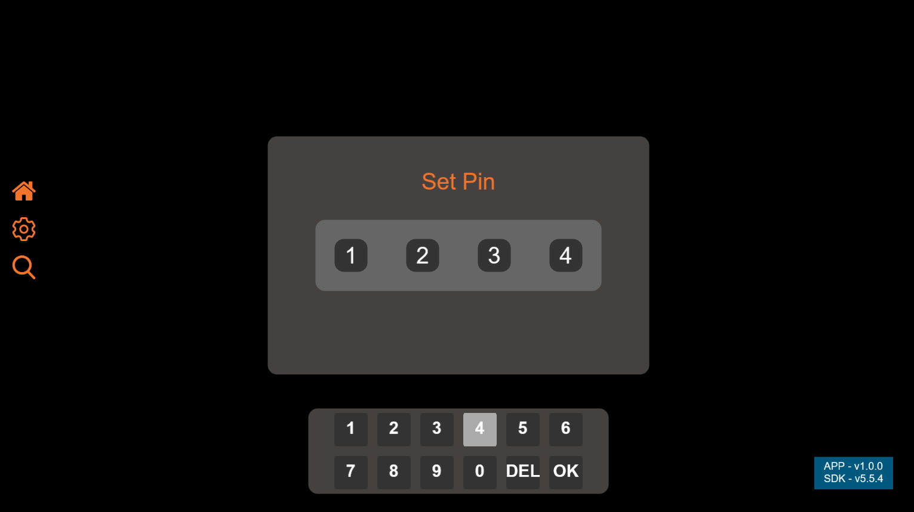

# Interflix

## Project Overview

Interflix is a TV application designed to deliver a seamless streaming experience for movies and TV shows. Developed by the LightningJS Interns Team, the application focuses on enhancing user experience, leveraging modern web technologies, and maintaining a lightweight structure for efficient performance.

**Project Highlights:**

- Intuitive user interface with a variety of movie and TV show collections.
- Features such as parental controls, robust search functionality, and customizable viewing experiences.

### Screenshots












---

## Team Members

- **Radu Suciu**
- **Raul Bucur**
- **Akos Kerekes**
- **Flavius Meghesan**
- **Claudiu Szidelo**

---

## Key Features

1. **Homepage**: Displays featured movies and TV shows, personalized recommendations, and genre-based navigation. - **Radu Suciu**
2. **Search Functionality**: Provides real-time suggestions and accurate results for quick content discovery. - **Flavius Meghesan**
3. **Detailed View**: Displays in-depth information about selected content, such as synopsis, cast, reviews, and trailers. - **Claudiu Szidelo**
4. **Parental Controls**: Allows parents to restrict access to certain content via a secure PIN, ensuring a safe environment for children. - **Akos Kerekes**
5. **Integrated Video Player**: Supports multiple formats with intuitive features like 15-second skip/replay buttons. - **Raul Bucur**

---

## Development Process

### Methodology

- **Agile Development**: Adopted for flexible, iterative progress and continuous feedback.
- **Sprint Planning**: Divided the project into three sprints, each focusing on specific features and improvements.

### Tools and Technologies

- **Framework**: LightningJS
- **Language**: TypeScript
- **Testing**: Emphasized continuous integration and regular testing to maintain stability.

### Data Management

- Modular architecture ensures seamless integration of data-fetching, user settings, and streaming services.
- Centralized logic transforms raw data into accessible formats for display, maintaining accuracy and coherence.

---

## Challenges and Solutions

**Challenge**: Managing the complexity of integrating multiple services like data fetching and streaming.
**Solution**: Adopted a modular architecture for independent service operations, allowing easier updates and maintenance.

---

## Reflections and Future Steps

The development of Interflix was an enriching experience, combining technical innovation and teamwork. Looking ahead, we aim to introduce new functionalities and integrations to elevate the user experience further.

---

## Acknowledgements

Thank you for exploring Interflix.

---

### Getting started

> Before you follow the steps below, make sure you have the
> [Lightning-CLI](https://rdkcentral.github.io/Lightning-CLI/#/) installed _globally_ only your system

```
npm install -g @lightningjs/cli
```

#### Running the App

1. Install the NPM dependencies by running `npm install`

2. Build the App using the _Lightning-CLI_ by running `lng build` inside the root of your project

3. Fire up a local webserver and open the App in a browser by running `lng serve` inside the root of your project

#### Developing the App

During development you can use the **watcher** functionality of the _Lightning-CLI_.

- use `lng watch` to automatically _rebuild_ your App whenever you make a change in the `src` or `static` folder
- use `lng dev` to start the watcher and run a local webserver / open the App in a browser _at the same time_

#### Documentation

Use `lng docs` to open up the Lightning-SDK documentation.
